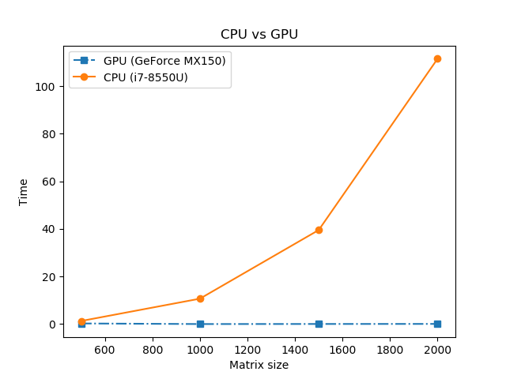

# GPU-accelerated Deep Learning

Setup
======
     
 * Windows 10
 * GPU: **GeForce MX150**
 * CPU: Intel i7-8550U
 * Python 3.6
 * tensorflow 1.9.0
 * tensorflow-gpu 1.9.0
 * tf-nightly-gpu 1.10.0a20180710
 * CUDA v9.0
 * CUDNN 9.0 windows10 x64 v7.1
 
Result Summary
==============

| Example | CPU  | GPU  | 
|:------: |:---: |:---: |
| [convnet on the MNIST dataset](https://github.com/lshang0311/deeplearning-gpu/blob/master/mnist_cnn.py)  | 70 seconds per epoch  | 17 seconds per epoch  |
| [word2vec](https://github.com/lshang0311/deeplearning-gpu/blob/master/word2vec_basic.py)  | 556 seconds (step 5, training)  | 326 seconds (step 5, training)|
| [classify movie reviews](https://github.com/lshang0311/deeplearning-gpu/blob/master/classify_movie_reviews.py)  | < 1 second  | < 1 second|

GPU vs CPU from Running [test_tf_mx150.py](http://vjethava.blogspot.com/2017/11/tensorflow-on-mx150.html)
---------------------

Result from Running [mnist_cnn.py](https://github.com/philferriere/dlwin/blob/master/mnist_cnn.py) 
---------------------
* About **17** seconds per epoch on a GeForce MX150 GPU
* About **70** seconds per epoch on a i7-8550U CPU

Script output
-
Using TensorFlow backend.

x_train shape: (60000, 28, 28, 1)
60000 train samples
10000 test samples
Train on 60000 samples, validate on 10000 samples

Epoch 1/12

2018-07-11 22:27:31.095678: I T:\src\github\tensorflow\tensorflow\core\platform\cpu_feature_guard.cc:141] Your CPU supports instructions that this TensorFlow binary was not compiled to use: AVX2
2018-07-11 22:27:31.783787: I T:\src\github\tensorflow\tensorflow\core\common_runtime\gpu\gpu_device.cc:1404] Found device 0 with properties: 
name: GeForce MX150 major: 6 minor: 1 memoryClockRate(GHz): 1.5315
pciBusID: 0000:01:00.0
totalMemory: 2.00GiB freeMemory: 1.62GiB

2018-07-11 22:27:31.784126: I T:\src\github\tensorflow\tensorflow\core\common_runtime\gpu\gpu_device.cc:1483] Adding visible gpu devices: 0
2018-07-11 22:27:32.511687: I T:\src\github\tensorflow\tensorflow\core\common_runtime\gpu\gpu_device.cc:964] Device interconnect StreamExecutor with strength 1 edge matrix:
2018-07-11 22:27:32.511900: I T:\src\github\tensorflow\tensorflow\core\common_runtime\gpu\gpu_device.cc:970]      0 
2018-07-11 22:27:32.512040: I T:\src\github\tensorflow\tensorflow\core\common_runtime\gpu\gpu_device.cc:983] 0:   N 
2018-07-11 22:27:32.512285: I T:\src\github\tensorflow\tensorflow\core\common_runtime\gpu\gpu_device.cc:1096] Created TensorFlow device (/job:localhost/replica:0/task:0/device:GPU:0 with 1379 MB memory) -> physical GPU (device: 0, name: GeForce MX150, pci bus id: 0000:01:00.0, compute capability: 6.1)
2018-07-11 22:27:32.513071: E T:\src\github\tensorflow\tensorflow\core\common_runtime\gpu\gpu_device.cc:228] Illegal GPUOptions.experimental.num_dev_to_dev_copy_streams=0 set to 1 instead.
 - 20s - loss: 0.2679 - acc: 0.9179 - val_loss: 0.0605 - val_acc: 0.9800

Epoch 2/12
 - 17s - loss: 0.0903 - acc: 0.9736 - val_loss: 0.0469 - val_acc: 0.9852

Epoch 3/12
 - 17s - loss: 0.0676 - acc: 0.9797 - val_loss: 0.0380 - val_acc: 0.9868

Epoch 4/12
 - 17s - loss: 0.0545 - acc: 0.9834 - val_loss: 0.0319 - val_acc: 0.9892

Epoch 5/12
 - 17s - loss: 0.0473 - acc: 0.9857 - val_loss: 0.0338 - val_acc: 0.9882

Epoch 6/12
 - 17s - loss: 0.0422 - acc: 0.9869 - val_loss: 0.0300 - val_acc: 0.9899

Epoch 7/12
 - 17s - loss: 0.0375 - acc: 0.9886 - val_loss: 0.0292 - val_acc: 0.9903

Epoch 8/12
 - 17s - loss: 0.0348 - acc: 0.9893 - val_loss: 0.0292 - val_acc: 0.9900

Epoch 9/12
 - 17s - loss: 0.0317 - acc: 0.9898 - val_loss: 0.0288 - val_acc: 0.9902

Epoch 10/12
 - 17s - loss: 0.0291 - acc: 0.9912 - val_loss: 0.0287 - val_acc: 0.9910

Epoch 11/12
 - 17s - loss: 0.0272 - acc: 0.9915 - val_loss: 0.0272 - val_acc: 0.9909

Epoch 12/12
 - 17s - loss: 0.0262 - acc: 0.9923 - val_loss: 0.0270 - val_acc: 0.9916

Test loss: 0.026977146334353164
Test accuracy: 0.9916